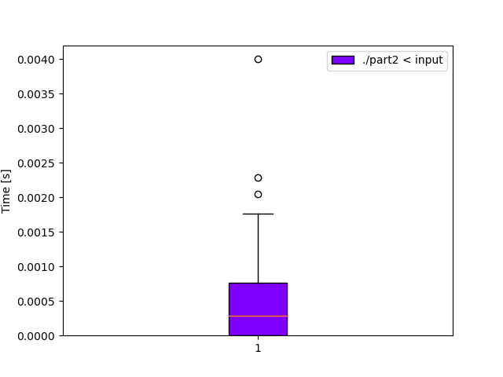

# Day 10: [Cathode-Ray Tube](https://adventofcode.com/2022/day/10)
*Nim: [Part 1](https://github.com/DestyNova/advent_of_code_2022/blob/main/10/part1.nim) (00:10:13, rank 1066), [Part 2](https://github.com/DestyNova/advent_of_code_2022/blob/main/10/part2.nim) (00:23:22, rank 1208)*

So close to top-1000!

## Part 1

This felt like a great choice for Nim. Really basic imperative loop, but with a couple of gotchas. When I saw the phrase "during the first cycle" in the description text, I knew there would be off-by-one problems since it wasn't immediately clear to me what exactly "during" meant. After trying almost every combination possible (start counting time at 0? 1? update things in which order? modulo against the current time or `t-1` or `t+1`?) I managed to get the correct output without too much trouble. In fact I was surprised to get it that quickly.

## Part 2

I absolutely love this type of puzzle and especially the ones that produce a bitmap with the answer, since you know immediately that it's correct. It's like doing a scratchcard and unexpectedly winning a prize.

## Alternate implementations

(none yet)

## Thoughts

This was good fun and I'm pleased at how it went. Got some decent catchup sleep in the past 2 or 3 days so that seems to be helping already, and I'm guzzling green tea each morning with my new cheapo teapot with a removable metal tea leaf filter.

I struggled with small output errors in part two due to again being unsure about the order in which things should happen -- eventually I realised the CRT draw step should always happen before anything else is updated. But in retrospect, I probably should have run the program earlier on the full input, because it may actually have been readable even if it wasn't fully correct. That could have saved a minute or two.

## Benchmarks

Another problem that's extremely computationally cheap, coming in at 0.4 ms mean runtime for Nim and a frugal 1560 kb peak memory usage.

### Time

```
(no)
```



### Summary

Program       | Compile time (s) | Mean runtime (ms) | Max RSS (kb) | Source bytes | Source gzipped
---           | ---              | ---               | ---          | ---          | ---
part2_crystal |                  |                   |              |              |    
part2_nim     |                  |                   |              |              |    
