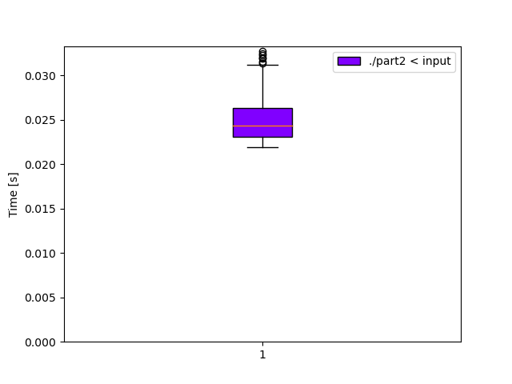

# Day 11: [Monkey in the Middle](https://adventofcode.com/2022/day/11)
*Nim: [Part 1](https://github.com/DestyNova/advent_of_code_2022/blob/main/11/part1.nim) (00:48:54, rank 4533), [Part 2](https://github.com/DestyNova/advent_of_code_2022/blob/main/11/part2.nim) (01:07:15, rank 3101)*

## Part 1

I stuck with Nim again since I'm getting more comfortable with it. This time, parsing took quite a while as I wasn't familiar with the `strscans` module and ended up with some quite hacky code that I was able to simplify a bit afterward.

While testing the program out, before keeping track of the number of inspections, I ran into quite a weird issue: I was iterating over the mutable `var monkeys: seq[Monkey]` with a `for m in monkeys:`, and updating each monkey's `held` sequence. However, somehow those updates were _sort of_ lost at the start of the next round. I still don't really understand why, but the intermediate fix was to switch the outer loop to `for i in monkeys.len: var m = monkeys[i]` indexing. However, Michal Maršálek on the Code Golf Discord gave me a couple of great tips, including that the `mitems` iterator can be used instead of the (implicit) `items` one, if you need mutable access to each item.

I'm still not 100% sure what was going on earlier but no doubt it will arise again. I should probably read the Nim manual more carefully and try to understand some of the finer points -- I've never used the `ref` feature for example, so there's probably some really important stuff I'm missing.

That said, the program still runs really fast.

## Part 2

As knew upon reading the part 2 description that some kind of clever modulo trick was probably needed, but just couldn't figure it out for nearly 20 mins. Eventually I realised that there were a finite number of monkeys, each with its own modulo value, so if I just multiplied all of them and kept taking the modulo of that when passing a "worry" value around, it would produce the correct behaviour.

## Alternate implementations

(none yet)

## Thoughts

Again, not a great result but I'm pretty happy with my performance today. Just need to learn a bit more about Nim and... well, think faster and better I guess. The `scanf` thing was annoying, but I eventually understood what the [doc says about $* and $+](https://nim-lang.org/docs/strscans.html):

> Matches until the token following the $+ was found.

I thought this meant that `$+` should be followed by another matcher which you expect to be repeated, but that's not it at all -- it literally means "match _ANY_ characters _UNTIL_ one that matches the next matcher or end-of-line".

This meant I could get rid of my "call scanf multiple times until one of them succeeds" code and just call it once with a single `$+` at the end to match either "old" or an integer.

I can foresee this being important in future, since there's no way to match e.g. a list of integers with the default matchers, so instead we need to match all of it and manually split.

## Benchmarks

This one is slightly more computationally expensive than previous days, but not by much, coming in at 25.2 ms mean runtime for Nim and a frugal 1664 kb peak memory usage.

### Time

```
Benchmark 1: ./part2_nim < input
  Time (mean ± σ):      25.2 ms ±   2.8 ms    [User: 24.8 ms, System: 0.9 ms]
  Range (min … max):    21.9 ms …  32.8 ms    102 runs
```



### Summary

Program       | Compile time (s) | Mean runtime (ms) | Max RSS (kb) | Source bytes | Source gzipped
---           | ---              | ---               | ---          | ---          | ---
part2_crystal |                  |                   |              |              |    
part2_nim     |                  |                   |              |              |    
