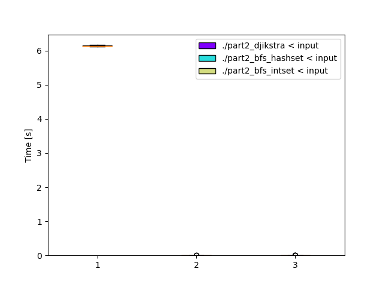

# Day 12: [Hill Climbing Algorithm](https://adventofcode.com/2022/day/12)
*Nim: [Part 1](https://github.com/DestyNova/advent_of_code_2022/blob/main/12/part1.nim) (02:31:07, rank 8292), [Part 2](https://github.com/DestyNova/advent_of_code_2022/blob/main/12/part2.nim) (02:35:45, rank 7790)*

## Part 1

Before getting even halfway through the text I figured this was a Dijkstra problem. I started writing a Nim program, and very short-sightedly just glanced at the `sets` API and noticed it didn't have a priority-queue "min-find" sort of function. I figured the problem might be small enough for solving with Floyd-Warshall instead, and spent aaaages trying to implement that. In the end, I got it working for the sample input, but the result it produced for the full input file was too low.

At this point I decided to take another look and see if there was something I could use in the Nim stdlib, and lo and behold, there's a `heapqueue` implementation that does exactly what I need. Whoops.

It didn't take too long from there to dump the Floyd-Warshall implementation (which had taken about 15-20 minutes to run) and replace it with a working implementation of Dijkstra search, which returned the correct result in under 10 ms.

## Part 2

Well, if I'd gotten part 1 to work properly with Floyd-Warshall, part 2 would have been (relatively) trivial since it computes distances between all pairs of vertices. Although it would still take at least 15-20 minutes waiting for it to run. In retrospect, I was probably thinking of Bellman-Ford which has one less level of nesting and might have run in reasonable time.

Anyway, Dijkstra's algorithm is pretty fast so looping through the graph and running the entire search again for matching source nodes (either 'S' or 'a') produced the correct result in 6.152 seconds.

## Alternate implementations

(none yet)

## Thoughts

I should probably be disappointed with my worst leaderboard place yet, but honestly I'm pretty happy with this one. The Dijkstra implementation feels pretty neat. As usual Nim impresses with its conservative memory use: running the part 2 program on the full input (181x41 = 7421 vertices) used a max of 2300 kb RSS.

That Dijkstra implementation might come in handy in future puzzles too. I'm tempted to try implementing another directed-with-no-cycles algorithm too.

**Update 1:** Jakob from the Code Golf Discord channel pointed out that since the edge weights are all 1, we can use BFS instead of Dijkstra. It's nearly the same, except that instead of storing tuples of vertex index and priority in a binary min-heap, we can instead just append each vertex index (an unboxed int) to a `std/deque`. Nice to see a variety of useful data structures in the Nim stdlib.
I made this change and it's over 20 times faster than the Dijkstra version. It also uses about 400kb less memory. Neat!

**Update 2:** Right from the beginning, I made an optimisation choice to represent vertex coordinates as a single unboxed int, by doing multiplication/addition and division/modulo operations when converting from coordinate to index and vice versa. I was thinking this would result in much more efficient storage and faster access. But to actually verify that, I added another version `part2_bfs_hashset` that gets rid of those conversions and just stores tuples in the `visited` hashset, where the `part2_bfs_intset` stores the converted index and `visited` is a `std/intset`.

As it happens, the hashset version is only very slightly slower, coming in at 4.5 ms as opposed to 4.0 ms for intset, both within the "might be inaccurate due to shell startup overhead" margin of error that Hyperfine warns us about.

So the moral of the story is... again... start with the simplest feasible implementation that makes sense for the problem you're facing. If edges are unweighted (or uniformly weighted), use BFS instead of Dijkstra. But don't use Floyd-Warshall unless... well I don't know; I guess if you need to find paths between many different source and destination nodes.

## Benchmarks

### Time

```
Benchmark 1: ./part2_djikstra < input
  Time (mean ± σ):      6.141 s ±  0.017 s    [User: 6.135 s, System: 0.003 s]
  Range (min … max):    6.110 s …  6.167 s    10 runs
 
Benchmark 2: ./part2_bfs_hashset < input
  Time (mean ± σ):       4.5 ms ±   1.0 ms    [User: 3.9 ms, System: 1.0 ms]
  Range (min … max):     2.3 ms …   7.7 ms    485 runs
 
  Warning: Command took less than 5 ms to complete. Note that the results might be inaccurate because hyperfine can not calibrate the shell startup time much more precise than this limit. You can try to use the `-N`/`--shell=none` option to disable the shell completely.
 
Benchmark 3: ./part2_bfs_intset < input
  Time (mean ± σ):       4.0 ms ±   0.8 ms    [User: 3.4 ms, System: 1.0 ms]
  Range (min … max):     2.0 ms …   7.9 ms    426 runs
 
  Warning: Command took less than 5 ms to complete. Note that the results might be inaccurate because hyperfine can not calibrate the shell startup time much more precise than this limit. You can try to use the `-N`/`--shell=none` option to disable the shell completely.
 
Summary
  './part2_bfs_intset < input' ran
    1.13 ± 0.33 times faster than './part2_bfs_hashset < input'
 1542.78 ± 318.27 times faster than './part2_djikstra < input'
```



### Summary

Program       | Compile time (s) | Mean runtime (ms) | Max RSS (kb) | Source bytes | Source gzipped
---           | ---              | ---               | ---          | ---          | ---
part2_crystal |                  |                   |              |              |    
part2_nim     |                  |                   |              |              |    
