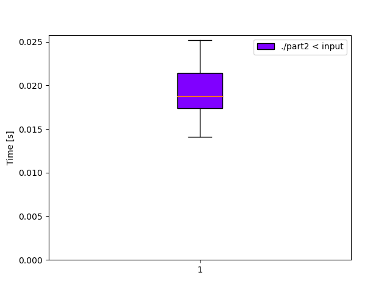

# Day 13: [Distress Signal](https://adventofcode.com/2022/day/13)
*Nim: [Part 1](https://github.com/DestyNova/advent_of_code_2022/blob/main/13/part1.nim) (01:28:00, rank 5708), [Part 2](https://github.com/DestyNova/advent_of_code_2022/blob/main/13/part2.nim) (01:41:58, rank 5429)*

## Part 1

I sat there staring at this for a long time, trying to understand how to even start. This was an interesting situation -- I went back and forth trying to come up with a mega-imperative way of doing the parsing, at some point writing and throwing away code for maintaining offsets into two strings at once.

Then I thought: "how would I do something like this in Haskell?" and figured I would have:

1. defined a `Packed` sum type to represent each term, which could be either an `IntPacket Int` or `ListPacket (List Packet)`
2. parsed each line into a `Packet` (always a `ListPacket` at the outer level)
3. recursively compared pairs of packets.

Once I reached this stage, it started to get easier. However, I had no idea how to define a sum type in Nim, but this was quickly solved with a few web searches. Nim's object types are a bit funky and don't directly allow for sum types the way we'd define them in Haskell, but rather you add a `kind` field and then a `case` expression switching on it, defining the specific fields in each matching arm. Also, recursive type definitions are not allowed in "normal" objects, so you have to define a `ref object` instead.

Unfortunately I also had no idea what a `ref object` was or how to use one, but... in the end it wasn't too bad.

I also got hung up a bit later when the example showed a "left" list that was longer than the "right" list, but still was considered in order. This turned out to be a reading fail on my part -- I was treating equality between two items the same as the `a < b` case, and continuing to check further items when we should terminate early and say two items are in order if we found an `a < b`.

## Part 2

Thankfully this was a fairly reasonable continuation of part 1. I had already defined the `compareTerms` function to return -1, 0 or 1 corresponding to `<`, `==` and `>`, so this just needed to be wrapped with another proc that compares two lines, and the input handling slightly reworked. It took a bit longer than necessary and somehow I forgot that `&` is the sequence append operator, not `++`, and I really struggled to find it in the Nim docs. I searched for "nim append seqs" and didn't immediately see an obvious answer, but on closer inspection the second result (Nim's `std/sequtils` page) mentions on the first page that it's `&` in the system module.

## Alternate implementations

(none yet)

## Thoughts

Another very mediocre performance, and I was really starting to despair while working on part 1. I really didn't know how to proceed, until I started thinking about breaking the problem down in a semi-functional way as I would have when coding in Haskell. Sometimes in the rush, I just want to start banging code out, but it's still important to pause a bit and think top-down until the way forward becomes clear.

## Benchmarks

### Time

```
Benchmark 1: ./part2 < input
  Time (mean ± σ):      19.3 ms ±   2.8 ms    [User: 18.5 ms, System: 1.3 ms]
  Range (min … max):    14.1 ms …  25.2 ms    120 runs
```



### Summary

Program       | Compile time (s) | Mean runtime (ms) | Max RSS (kb) | Source bytes | Source gzipped
---           | ---              | ---               | ---          | ---          | ---
part2_crystal |                  |                   |              |              |    
part2_nim     |                  |                   |              |              |    
