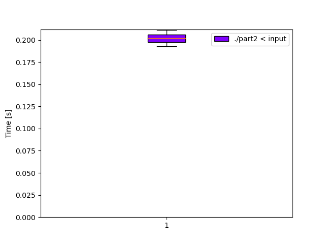

# Day 14: [Regolith Reservoir](https://adventofcode.com/2022/day/14)
*Nim: [Part 1](https://github.com/DestyNova/advent_of_code_2022/blob/main/14/part1.nim) (01:05:21, rank 4906), [Part 2](https://github.com/DestyNova/advent_of_code_2022/blob/main/14/part2.nim) (01:21:24, rank 4816)*

## Part 1

It took me a while to figure out that... this one is pretty simple. It was just a case of representing the grid in memory. At first I collected the min/max bounds of the grid and tried to statically define a 2D array for speed (when will you learn not to optimise for speed at this point??) but Nim just would not let me, claiming I'd defined an invalid typespec, even though it looked like all the other examples I've seen.

So that wasted a few minutes before I gave up and stored it all in a `seq[seq[char]]`. This is definitely something that would have gone more smoothly in Haskell, since I'd just say it's a `List String` and move on. That said, I'd be generating a new grid on every timestep in Haskell, but... well it probably wouldn't matter in the slightest.

## Part 2

This again turned out to be a small extension of part 1, although I was initially struck by a fear that sand would flow out the sides and I'd have to either extend everything horizontally, or do some kind of heuristic grid calculation when things flow out the edges. Then I realised the pile of sand couldn't be wider than it is tall, and we know how tall it is, so I just extended the left and right edges to fit that. In fact I probably extended them too far -- I guess the X bounds should be (500 +/- maxY div 2). Maybe I'll update that now.

## Alternate implementations

(none yet)

## Thoughts

Yet another mediocre performance where reading comprehension was possibly the most difficult part. Also, another reminder: start with dumb, easy-to-use data structures like `seq[seq[char]]`. In fact I could probably have even stored everything in a mutble hashtable and not even bothered finding the min/max bounds first. Nim is pretty fast.

## Benchmarks

### Time

```
Benchmark 1: ./part2 < input
  Time (mean ± σ):     201.7 ms ±   5.6 ms    [User: 199.5 ms, System: 2.3 ms]
  Range (min … max):   192.8 ms … 211.1 ms    15 runs
```



### Summary

Program       | Compile time (s) | Mean runtime (ms) | Max RSS (kb) | Source bytes | Source gzipped
---           | ---              | ---               | ---          | ---          | ---
part2_crystal |                  |                   |              |              |    
part2_nim     |                  |                   |              |              |    
