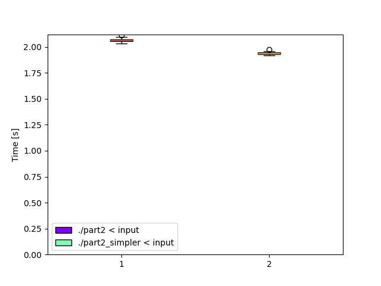

# Day 15: [Beacon Exclusion Zone](https://adventofcode.com/2022/day/15)
*Nim: [Part 1](https://github.com/DestyNova/advent_of_code_2022/blob/main/15/part1.nim) (01:31:44, rank 5673), [Part 2](https://github.com/DestyNova/advent_of_code_2022/blob/main/15/part2.nim) (02:00:46, rank 3321)*

## Part 1

Upon first glancing at the text, a memory of dread began to arise as I recalled the [Beacon Scanner](https://adventofcode.com/2021/day/19) puzzle from AoC 2021. However today's problem turned out to be much simpler as it's confined to two dimensions and we don't need to consider orientation. And this time, the sensors know where they are.

However it still took me a while to actually fully grasp the problem, so I laboured under some false assumptions for a while. I made a big deal out of whether the beacon was to the left or right of the sensor, but this could be reduced to a fairly simple conditional addition, and I'm sure there's a nicer way to do it (like maybe just defining the range, then excluding the beacon from it, if there's a built-in for that).

When it came to merging the line segments, I could immediately see that overlaps would be an issue. This probably would have been perfectly reasonable to solve with an O(N^2) comparison of pairs, but I figured it would be a good time to look up "proper" ways of doing this. Eventually I stumbled upon some pseudocode (well, Python) for [merging intervals](https://www.geeksforgeeks.org/merging-intervals/) which seemed to work ok.

Then I got the wrong answer on the input and scratched my head for 2 or 3 minutes before realising I hadn't updated the target row from 10 to 2000000. Not the first time and almost certainly won't be the last time either.

## Part 2

Again it took me a little while just to understand what exactly was being asked of us in part 2. Basically it seemed that on each row within the target X bounds, there could be either zero or one cell that can't be proven empty by the unification of sensor data we did in part 1. And only one row in the target Y bounds could hold that cell.

So my first naieve approach was to iterate over each row, calculate the merged line segments, then walk across each X coordinate in the row within the range 0..4000000 and check if the current (x,y) doesn't exist in the beacon set nor in the empty segments. This turned out to be far too slow and might have taken up to 10 hours to complete.

Typical that when I decide to try an efficient method first, it turns out to be an unnecessary optimisation, but when I decide to try the naieve approach, it's way too slow.
Anyway, after a couple of minutes thought, it occurred to me that by sorting the merged line intervals, I could walk them and check for a gap between the end of one interval and the start of the next. If the problem description is accurate, then all intervals should be either overlapping or contiguous, except for exactly one pair on one specific row.

Having merged the intervals there were no longer any overlaps (and there's no particular benefit to merging them in part 2 anyway -- I'll try removing that step in a sec), so I just had to iterate over each row, calculate the sorted list of empty segments, then walk them and check for a difference between the end and beginning of two consecutive intervals. This produced the correct result in about 2.2 seconds.

**Update:** I tried removing the interval merging step from part 2, and the updated version (`part2_simpler.nim`) is about 5-10% faster. Also, I made use of the `collect` macro from `std/sugar` and really like it -- it's like a combination map/filter and really helps express useful operations concisely.

## Alternate implementations

(none yet)

## Thoughts

Part 1 didn't go so well, and I caught myself starting to feel some anxiety and frustration over not understanding things quicker. In contrast, part 2 was relatively easier because the vast majority of the work had already been done in part 1.

## Benchmarks

### Time

```
Benchmark 1: ./part2 < input
  Time (mean ± σ):      2.070 s ±  0.022 s    [User: 2.068 s, System: 0.002 s]
  Range (min … max):    2.034 s …  2.112 s    10 runs
 
Benchmark 2: ./part2_simpler < input
  Time (mean ± σ):      1.940 s ±  0.017 s    [User: 1.938 s, System: 0.002 s]
  Range (min … max):    1.921 s …  1.976 s    10 runs
 
Summary
  './part2_simpler < input' ran
    1.07 ± 0.01 times faster than './part2 < input'
```



### Summary

Program           | Compile time (s) | Mean runtime (ms) | Max RSS (kb) | Source bytes | Source gzipped
---               | ---              | ---               | ---          | ---          | ---
part2_nim         | 1.4              | 2070              | 1668         | 1501         | 703
part2_simpler_nim | 1.4              | 1940              | 1656         | 1105         | 556
