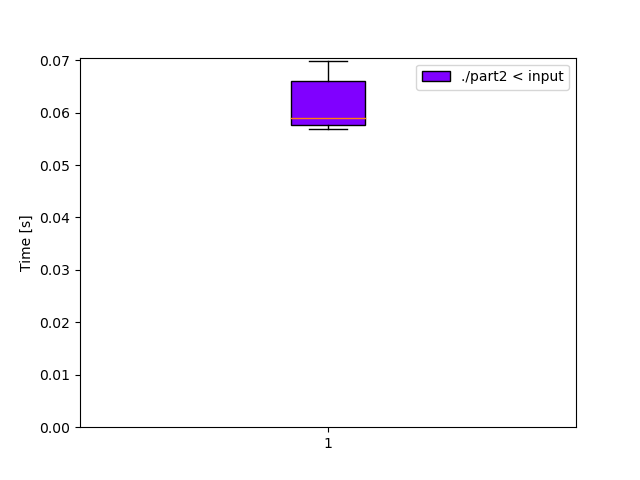

# Day 18: [Boiling Boulders](https://adventofcode.com/2022/day/18)
*Nim: [Part 1](https://github.com/DestyNova/advent_of_code_2022/blob/main/18/part1.nim) (00:28:46, rank 3098), [Part 2](https://github.com/DestyNova/advent_of_code_2022/blob/main/18/part2.nim) (04:02:15, rank 5012)*

## Part 1

This was a bit of fun, a spatial puzzle reminiscent of the beacon scanner rotations problem in 2021. Part 1 was relatively straightforward once the problem is framed as a count of unique cube faces. I chose to represent faces as a pair of diagonal vertices, but there are many other ways to do it...

## Part 2

This was a lot more complicated! I decided to change the representation of faces to the pair of (top-front-left coord, face enum val) and do a flood fill, using a set of faces that can be reached from the current one as an exploration queue, and a second set of already visited faces to avoid duplicate counting.

Starting with the left side of the leftmost-frontmost-lowest cube, I started manually enumerating the faces that can be reached from the current one. Even for that first face it started to get pretty busy, since there are three possible flows in each of the four directions -- for example, if we flow upwards from the left face:

* there could be a cube above and to the left, so we should flow onto its bottom face
* ... or there could be no cube there, but a cube directly above this one, so we should flow onto its left face
* ... or there could be no cube there either, so we flow around onto the current cube's top face.

Repeat these three options for flows in the down, front and back directions (no right, since we're blocked by the current cube), and you've covered the flows that happen just on the left side of the cube.
Initially I figured I'd just manually repeat all of that for the 6 sides, but was entirely certain I'd make several hard to detect errors that would waste hours of time. Instead, I decided to try to automate the rotations of the cube, making a pair of higher-order functions `translator` and `rotator` that take information about the current face and allow for easy rotations and translations back to absolute orientation.

Soon enough though, I discovered it was sometimes counting an internal face. I tried a few things, like converting faces back to a hashset-of-vertex representation in case opposing faces were being counted twice. But then, there shouldn't be any opposing faces because they then wouldn't be exposed to the surface.
Eventually I discovered a really silly error. See if you can spot it:

```nim
  # to back
  if f(-1,0,+1) in cubes:
    # back to Front of cube x-1 z+1
    reachable.incl((f(-1,0,+1), r(Front)))
  elif (0,0,+1) in cubes:
    # back to Left of cube z+1
    reachable.incl((f(0,0,+1), r(Left)))
  else:
    # back to Back of this cube
    reachable.incl((c, r(Back)))
```

See it yet? :)

## Alternate implementations

(none)

## Thoughts

A fun puzzle. I made quite a few really sloppy mistakes in part 2. My brain was already overloaded just mentally doing the cube rotations to map movement relative to the left face onto movement relative to another face. At some point I was holding two Rubik's cubes next to each other and saying things to myself like "ok so if THIS corner is (1,1,1) and we're flowing from the back face, but THAT cube is in the way, we should explore its left face... but how is it reaching this face from here? That should be impossible... oh wait... no..."

I'm still not happy with the implementation of the `getVertices` function -- I tried basing it on cube rotations, but it messed everything up since there's an offset that needs to be added. But for this type of mapping, I think two rotations are needed, and the way I implemented `rotate` and `translate` unfortunately doesn't allow for easy composition. If you can think of a nice way to refactor this, let me know!

## Benchmarks

### Time (`-d:release --gc:orc`)

```
Benchmark 1: ./part2 < input
  Time (mean ± σ):      61.3 ms ±   4.3 ms    [User: 59.2 ms, System: 2.2 ms]
  Range (min … max):    56.9 ms …  69.8 ms    51 runs
```



### Summary

Program             | Compile time (s) | Mean runtime (ms) | Max RSS (kb) | Source bytes | Source gzipped
---                 | ---              | ---               | ---          | ---          | ---
part2_nim           | ~1.4             | 61.3              | 3728         | 4813         | 1301
