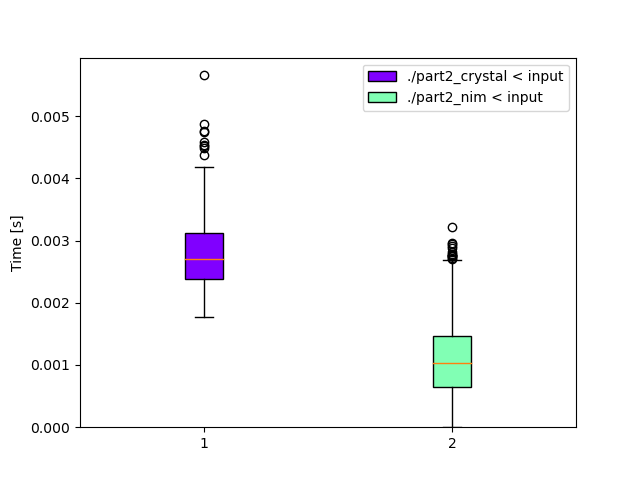

# Day 2: [Rock Paper Scissors](https://adventofcode.com/2022/day/2)
*Nim: [Part 1](https://github.com/DestyNova/advent_of_code_2022/blob/main/2/part1.nim) (00:13:08, rank 4768), [Part 2](https://github.com/DestyNova/advent_of_code_2022/blob/main/2/part2.nim) (00:20:35, rank 4777)*

Another easy but slightly more complicated puzzle.

## Part 1

This was another nice straightforward puzzle. I quickly ran into the limitations of Nim's lack of pattern-matching support when trying to do a `case (elfMove, myMove):`, only to get this error:

```
Error: selector must be of an ordinal type, float or string
```

That's a shame. To get around it, I did a very ugly thing and concatenated both values using string interpolation, then matched on the result. Oh well.

## Part 2

This was a fairly small extension of the initial solution, but I was able to drop the ugly strformat code and simplify the logic to three case expressions for the win/lose/draw moves + one more case expression to select whether we're winning, losing or drawing.

## Alternate implementations

### Crystal


## Benchmarks

Today's problem wasn't computationally difficult, so there's not much of interest in these benchmarks. Both implementations ran really quickly. I'm more interested to see the memory usage stats over time as we get to more complex problems: Crystal seems to be very memory efficient (at least, from the perspective of working with JVM languages for years), but Nim is extremely frugal, especially using the new ORC garbage collector, which seems to be more of a "statically generated deallocation + ref counter for cyclical pointers" thing.

### Time

```
Benchmark 1: ./part2_crystal < input
  Time (mean ± σ):       2.2 ms ±   0.5 ms    [User: 2.1 ms, System: 1.9 ms]
  Range (min … max):     1.3 ms …   3.8 ms    587 runs
 
Benchmark 2: ./part2_nim < input
  Time (mean ± σ):       0.9 ms ±   0.6 ms    [User: 0.9 ms, System: 0.5 ms]
  Range (min … max):     0.0 ms …   2.9 ms    1092 runs
 
Summary
  './part2_nim < input' ran
    2.50 ± 1.71 times faster than './part2_crystal < input'
```



### Memory

Program | Max RSS (kb)
---     | ---
part2_crystal | 3732
part2_nim | 1744
