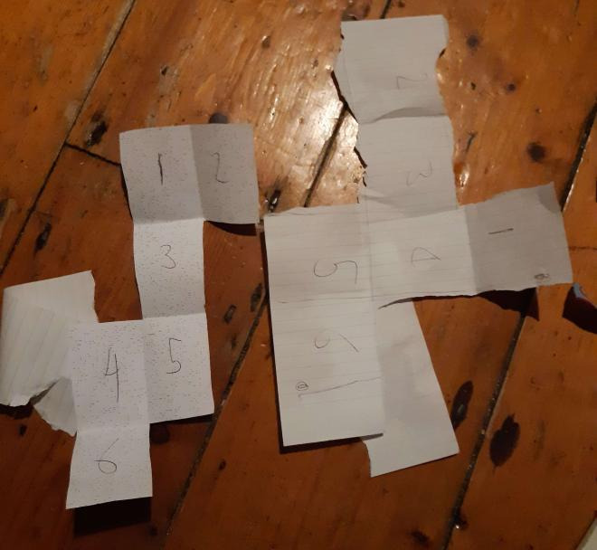
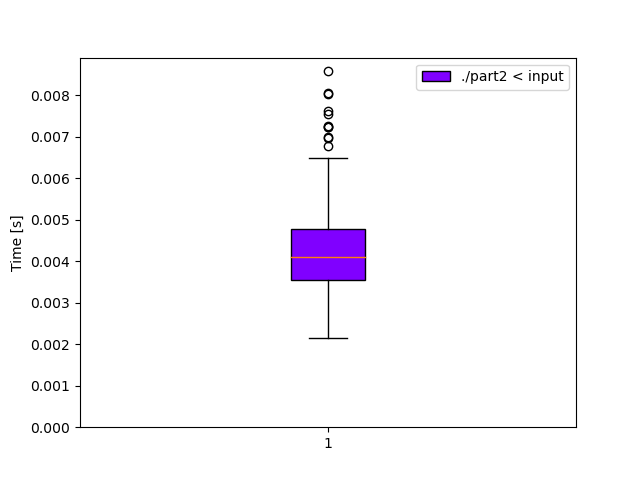

# Day 22: [Monkey Map](https://adventofcode.com/2022/day/22)
*Nim: [Part 1](https://github.com/DestyNova/advent_of_code_2022/blob/main/22/part1.nim) (01:09:47, rank 1859), [Part 2](https://github.com/DestyNova/advent_of_code_2022/blob/main/22/part2.nim) (03:44:00, rank 1530)*

## Part 1

Parsing was a bit of a challenge here, until I discovered the extremely useful [strutils/tokenize](https://nim-lang.org/docs/strutils.html#tokenize.i%2Cstring%2Cset%5Bchar%5D) function, which allowed me to do the following conversion:

```
"123L4R5".tokenize({'L','R'}) => @[("123", false), ("L", true), ("4", false), ("R", true), ("5", false)]

```

This incredibly useful, since using `split` would consume the separators and we'd lose critical information. To transform the directions string into a `seq[Move]`, all I needed was:

```nim
let moves: seq[Move] = collect:
  for (token, isSep) in dirs.tokenize({'L','R'}):
    if isSep:
      Move(kind: mTurn, dir: (if token == "L": L else: R))
    else:
      Move(kind: mMove, steps: token.parseInt)
```

This example also shows the power of the [collect](https://nim-lang.org/docs/sugar.html#collect.m%2Cuntyped) macro in Nim.

Given that there would be several extra "out of bounds" conditions beyond the usual grid-based puzzles, I decided to store the valid cube locations in a hashmap of `(int,int),bool`, where the bool signifies a wall. This made bounds-checking very easy: if it's not in the table, it's not on the cube. Initially I thought this would be inefficient compared to storing everything in a big array, but... it really isn't. I'll probably rely on this method in future too, especially where the bounds or extent of the array are initially unclear, or if the grid is expected to grow on subsequent turns (as has happened in some previous challenges).

My first answer was wrong, despite getting the correct answer on the sample input. This was a bit baffling, but after a quick scan through the different cases I was handling, I realised I'd missed the case where we wrap around and encounter a wall on the other side -- once I added a check for this, part 1 was done.

## Part 2

Another very difficult part 2, I think. Now our flat plane map has turned into an unfolded cube, and walking off each edge should wrap us around to the correct place and orientation we'd get if the cube was folded back up. First, there was the difficulty in wrapping my head around the cube movement. After a long period of trying to do mental rotations and translations, I ended up writing the sample cube layout on paper and folding it to see which edge transitions lined up where. A couple of helper functions -- `rotate` and `translate` made things a bit easier but still quite confusing.

Eventually I got the correct answer on the sample input, but my program immediately crashed on the full input by trying to wrap into a nonexistent part of the cube.
I opened the input file and zoomed out to try to understand what might be happening, and immediately realised that the geometry was completely different from the example case! This was __really__ annoying and a significant waste of time. This meant I would have to completely redo all of the face transitions. At least that was much quicker this time -- I printed a zoomed out sheet of the input file, cut it out and started folding to figure out the four critical bits of information for each case:

1. Pre-orientation: Which direction we're facing now
2. Post-orientation: which direction we'll be facing afterward
3. Rotation: How many rotations of this face we'd need to line it up with the destination face
4. Translation: The horizontal and vertical distance we'd need to move the rotated tile to line up with the rotated face



After I'd made the changes, my program crashed again, and I quickly found that I'd forgot to update one of the cases and was trying to move into the void. Once that was fixed, it produced the correct solution pretty quickly.

## Alternate implementations

(none)

## Thoughts

This was another fun and interesting puzzle. Having the input cube take a different unfolded shape (not just a different rotation or flip, but totally reconfigured) was kind of rough, but that's part of the challenge.

## Benchmarks

### Time (`-d:release --gc:orc`)

```
Benchmark 1: ./part2 < input
  Time (mean ± σ):       4.2 ms ±   0.8 ms    [User: 2.8 ms, System: 1.7 ms]
  Range (min … max):     1.8 ms …   9.8 ms    494 runs
 
  Warning: Command took less than 5 ms to complete. Note that the results might be inaccurate because hyperfine can not calibrate the shell startup time much more precise than this limit. You can try to use the `-N`/`--shell=none` option to disable the shell completely.
```



### Summary

Program             | Compile time (s) | Mean runtime (ms) | Max RSS (kb) | Source bytes | Source gzipped
---                 | ---              | ---               | ---          | ---          | ---
part2_nim           | 1.275            | 4.2               | 3844         | 4801         | 1527
