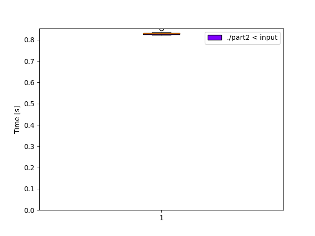

# Day 23: [Unstable Diffusion](https://adventofcode.com/2022/day/23)
*Nim: [Part 1](https://github.com/DestyNova/advent_of_code_2022/blob/main/23/part1.nim) (01:19:18, rank 2163), [Part 2](https://github.com/DestyNova/advent_of_code_2022/blob/main/23/part2.nim) (01:22:39, rank 1975)*

## Part 1

Another classic Advent of Code grid movement puzzle! This one was pretty nice but easy to get slightly wrong, as I did. Having previously had good success representing grids as a hashmap of `Coord -> thing`, this time I decided to stick with a similar set-based storage of the elf positions since it could potentially become quite sparse. This worked out really well again from a performance perspective.

After implementing what I thought were all the basic movement rules, my final state in the small example was slightly off, and I spent a long time checking the directions and ordering but couldn't find a problem. I added a `reportElves` function to visualise the grid (within the bounds of the elves), and an extra parameter to highlight individual elves so I could see their movement proposals one at a time. After a while I read through the problem spec again and realised I'd completely forgotten an extremely important rule: an elf surrounded by 8 empty cells will not move at all! I should have remembered this since the walked example finished with "at this point, no Elves need to move, and so the process ends" which I found a bit curious but ignored. Oops. So that probably wasted about 20 minutes. Anyway, once that bug was resolved (with the addition of a `nobodyAround` predicate), I got the right answer and moved on to part 2.

Along the way I discovered an unexpected thing in Nim's table implementation: duplicate entries after calling `add` a second time with the same key. Once spotted, I resolved this by calling `del` first, but afterwards I checked the [std/tables API doc](https://nim-lang.org/docs/tables.html#add%2CTable%5BA%2CB%5D%2CA%2CsinkB) and saw that `add` is deprecated due to precisely this confusion encountered by users, with a note to use `[]=` instead. Running into these RTFM situations is probably more common when rushing to implement a working solution to these puzzles.

## Part 2

Another very simple extension of part 1, the only things I can imagine going wrong were:

1. the grid growing significantly in size, and
2. it taking ages

Thankfully these factors didn't apply since I was storing the "grid" as a hashset of elf coordinates, and the proposed moves as a table of `(destination: Coord) -> seq[(sourceElf: Coord)]` and only updating the elves who appeared in a sequence of length 1 for the given destination.

## Alternate implementations

(none)

## Thoughts

Another enjoyable puzzle. And a reminder to maybe re-skim the problem spec sooner to make sure I understand the basic requirements before going heavy into debugging.

## Benchmarks

### Time (`-d:release --gc:orc`)

```
Benchmark 1: ./part2 < input
  Time (mean ± σ):     830.8 ms ±   8.4 ms    [User: 828.5 ms, System: 2.1 ms]
  Range (min … max):   822.8 ms … 852.1 ms    10 runs
```



### Summary

Program             | Compile time (s) | Mean runtime (ms) | Max RSS (kb) | Source bytes | Source gzipped
---                 | ---              | ---               | ---          | ---          | ---
part2_nim           | 1.369            | 830.8             | 2340         | 2552         | 1154
