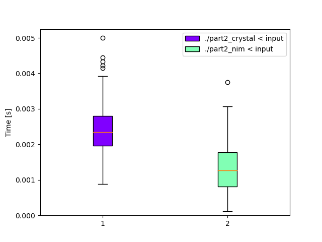

# Day 3: [Rucksack Reorganization](https://adventofcode.com/2022/day/3)
*Crystal: [Part 1](https://github.com/DestyNova/advent_of_code_2022/blob/main/3/part1.cr) (00:09:14, rank 2403), [Part 2](https://github.com/DestyNova/advent_of_code_2022/blob/main/3/part2.cr) (00:16:06, rank 2588)*

A nice puzzle that felt easier than day 2.

Almost missed this one since my alarm was only set for 4:50am on weekdays. Luckily my sleep is still messed up, so I awoke at 2:30am and couldn't get back to sleep anyway.

## Part 1

I decided to attempt this in Crystal unless complicated parsing is necessary, since Nim has a nice `scanf` function in the `strscans` module, and Crystal doesn't seem to have a similar counterpart. But today's problem had a very simple input format, so I ploughed ahead.

Like before, I reached for a fairly imperative-style solution first since I was panicking and rushing a bit. After finishing part 2, I went back and tidied both parts a bit, deleting superfluous code, prints etc, and converted the top-level `each` with mutation to a `reduce` sum.

## Part 2

As is often the case in the first few days' puzzles, part 2 was more a reading comprehension/speed test, and the solution actually ended up being slightly shorter than part 1 since I didn't have to split each line into two halves anymore.

Instead I did a `reduce` over the set of chars in each line, intersecting them each time. I couldn't figure out a way to combine the `map` and `reduce` steps, because when you call `reduce` without an explicit initial value, it takes it from the input collection. But that's how `foldl1` in Haskell works, too:

```
λ> :t foldl
foldl :: Foldable t => (b -> a -> b) -> b -> t a -> b
λ> :t foldl1
foldl1 :: Foldable t => (a -> a -> a) -> t a -> a
```

## Alternate implementations

### Nim

I basically just translated the Crystal solution line by line into Nim, but wasn't sure how best to achieve the `in_chunks_of` functionality in Crystal's stdlib, since the input lines needed to be processed in groups of 3. I could have switched to an imperative for-loop with a line counter, but managed to figure something out with the `sequtils.distribute` function even though that felt hacky. Instead of making an unspecified number of N-sized subsequences, `distribute` makes N subsequences of an unspecified size, so integer division was required to convert between the two behaviours.

## Benchmarks

As usual, both Nim and Crystal performed well, with Nim coming in very slightly faster. Crystal's build time of 16.7 seconds in release mode dwarfs the 0.6 seconds for Nim, but my `watch-crystal.sh` script compiles in debug mode which takes about 2 seconds.

I found it easier to get the programs written with Crystal today, due to the lack of a `in_chunks_of` function in the Nim stdlib. Both languages caught me out slightly with the need to explicitly convert the stdin lines iterator to a sequence (`to_a` in Crystal, `toSeq` in Nim), I guess to work around some kind of laziness thing.

### Time

(Note the error about shell startup time -- unfortunately disabling the shell causes Nim programs to crash for some reason, so take these numbers with an even larger grain of salt)

```
Benchmark 1: ./part2_crystal < input                                                                     
  Time (mean ± σ):       2.4 ms ±   0.6 ms    [User: 1.5 ms, System: 1.1 ms]                             
  Range (min … max):     0.9 ms …   5.0 ms    700 runs                                                                
                                                    
  Warning: Command took less than 5 ms to complete. Note that the results might be inaccurate because hyperfine can not calibrate the shell startup time much more precise than this limit. You can try to use the `-N`/`--shell=none` optio
n to disable the shell completely.                                                                       
                                                    
Benchmark 2: ./part2_nim < input                                                                         
  Time (mean ± σ):       1.3 ms ±   0.6 ms    [User: 1.2 ms, System: 0.5 ms]                                          
  Range (min … max):     0.1 ms …   3.7 ms    633 runs                                                                
                                                    
  Warning: Command took less than 5 ms to complete. Note that the results might be inaccurate because hyperfine can not calibrate the shell startup time much more precise than this limit. You can try to use the `-N`/`--shell=none` optio
n to disable the shell completely.                         
                                                           
Summary                                                                                                  
  './part2_nim < input' ran                                                                              
    1.81 ± 0.99 times faster than './part2_crystal < input'      
```



### Summary

Program | Compile time (s) | Mean runtime (ms) | Max RSS (kb) | Source bytes | Source gzipped
--- | --- | --- | --- | --- | ---
part2_crystal | 16.679 | 2.4 | 3784 | 226 | 189
part2_nim | 0.621 | 1.3 | 1756 | 301 | 225
