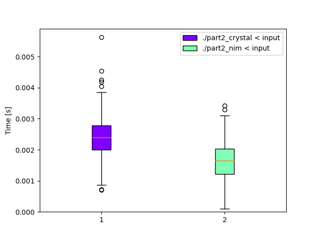

# Day 4: [Camp Cleanup](https://adventofcode.com/2022/day/4)
*Crystal: [Part 1](https://github.com/DestyNova/advent_of_code_2022/blob/main/4/part1.nim) (00:09:17, rank 4157), [Part 2](https://github.com/DestyNova/advent_of_code_2022/blob/main/4/part2.nim) (00:13:49, rank 4230)*

A very, very easy puzzle.

## Part 1

Again, I started with Crystal today, and made a real basic error by comparing the string representation of each number. It took me a minute or two to realise and parse them to ints.

## Part 2

Nothing special here; just use a slightly different predicate on each line.

## Alternate implementations

### Nim

I got lazy today and asked ChatGPT to translate my code to Nim, which it did. It forgot to specify a mutable variable as `var` and that destructuring assignments require tuple syntax, and a few imports were missing. But other than it had the right idea.

Afterwards, I still didn't quite like it, and decided to rewrite the imperative loop-and-update to a `foldl`. At first I thought this would require a `block:` expression, but I was able to just wrap the multiline expression body in parentheses and use it as the first parameter to `foldl`! (The second parameter being the starting value of the accumulator, `0`). That's really refreshing -- I expected some block/proc syntax would be needed, or a named function defined first, but this is much nicer.

The Nim program was as usual slightly larger than the Crystal one, but still quite readable I think. There's probably a much neater way to express it, anyway.

## Benchmarks

Again, today's problem was not computationally complex so there isn't really any significance to these numbers. I'm just recording them for completeness (since I went to the trouble of putting a script together...).

### Time

```
Benchmark 1: ./part2_crystal < input                                                                                  
  Time (mean ± σ):       2.4 ms ±   0.6 ms    [User: 1.5 ms, System: 1.1 ms]                             
  Range (min … max):     0.7 ms …   5.6 ms    528 runs                                                   
                                                                                                         
  Warning: Command took less than 5 ms to complete. Note that the results might be inaccurate because hyperfine can not calibrate the shell startup time much more precise than this limit. You can try to use the `-N`/`--shell=none` optio
n to disable the shell completely.                         
                                                           
Benchmark 2: ./part2_nim < input                                                                                      
  Time (mean ± σ):       1.6 ms ±   0.6 ms    [User: 1.4 ms, System: 0.6 ms]                              
  Range (min … max):     0.1 ms …   3.4 ms    716 runs     
                                                                                                         
  Warning: Command took less than 5 ms to complete. Note that the results might be inaccurate because hyperfine can not calibrate the shell startup time much more precise than this limit. You can try to use the `-N`/`--shell=none` optio
n to disable the shell completely.                                                                       
                                                           
Summary                                                                                                  
  './part2_nim < input' ran                                                                              
    1.49 ± 0.68 times faster than './part2_crystal < input'                  
```



### Summary

Program | Compile time (s) | Mean runtime (ms) | Max RSS (kb) | Source bytes | Source gzipped
--- | --- | --- | --- | --- | ---
part2_crystal | 16.495 | 2.4 | 3548 | 376 | 217
part2_nim | 0.546 | 1.6 | 1704 | 459 | 246
