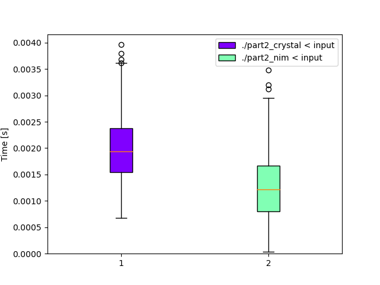

# Day 5: [Supply Stacks](https://adventofcode.com/2022/day/5)
*Crystal: [Part 1](https://github.com/DestyNova/advent_of_code_2022/blob/main/5/part1.nim) (00:33:01, rank 6265), [Part 2](https://github.com/DestyNova/advent_of_code_2022/blob/main/5/part2.nim) (00:37:00, rank 5749)*

A step up in difficulty, at least when it comes to parsing the input.

## Part 1

I started with Crystal again and took absolutely ages to parse the input properly. I'm not really sure why it was such a struggle, but it probably took 20 minutes or more to get it correct.
At first glance I thought it looked suitable for a transpose operation, but wasn't sure how to do it nicely in Crystal. This is definitely something that would have been quite comfortable in Haskell.

Similarly, I found myself wanting to use non-mutating updates on the different stacks, but had to get used to the operations provided by Crystal (shift, unshift, `<<`).

Pretty disappointed at how long it took to get this working.

## Part 2

Not much of a change here, but I ended up having to use a loop to move crates into a buffer, then prepend the destination stack with the reversed buffer. I was sure there was a way to do it in one step with the appropriate calls on the `Array` API, but didn't want to spend longer at it.

## Alternate implementations

### Nim

Again, I asked ChatGPT to translate it, but the result didn't make a lot of sense to me, so I asked it to solve the problem from scratch based on the problem description. It generated a program that handled the movements, but didn't populate the stacks, so I pointed this out and it immediately fixed the problem. The program was still a bit broken so I fixed it manually, adding imports, changing the way we read stdin, using the `add`, `delete` and `&` operations on sequences etc. Interestingly, ChatGPT had used some of Crystal operations on `Array`, so I wonder if it mixed in some of the Crystal code I'd written when first asking it to translate.

This time, the working Nim program was slightly shorter than the Crystal one which is kind of unusual, but then I probably approached the Crystal solution in a sloppy way that could be significantly improved.


## Benchmarks

Another very computationally cheap puzzle from which there are no interesting conclusions to be drawn about the various language implementations.

### Time

```
Benchmark 1: ./part2_crystal < input
  Time (mean ± σ):       2.0 ms ±   0.6 ms    [User: 1.4 ms, System: 0.8 ms]
  Range (min … max):     0.7 ms …   4.0 ms    589 runs

  Warning: Command took less than 5 ms to complete. Note that the results might be inaccurate because hyperfine can not calibrate the shell startup time much more precise than this limit. You can try to use the `-N`/`--shell=none` option to disable the shell completely.

Benchmark 2: ./part2_nim < input
  Time (mean ± σ):       1.2 ms ±   0.6 ms    [User: 1.0 ms, System: 0.6 ms]
  Range (min … max):     0.0 ms …   3.5 ms    938 runs

  Warning: Command took less than 5 ms to complete. Note that the results might be inaccurate because hyperfine can not calibrate the shell startup time much more precise than this limit. You can try to use the `-N`/`--shell=none` option to disable the shell completely.

Summary
  './part2_nim < input' ran
    1.60 ± 0.91 times faster than './part2_crystal < input'
```



### Summary

Program | Compile time (s) | Mean runtime (ms) | Max RSS (kb) | Source bytes | Source gzipped
--- | --- | --- | --- | --- | ---
part2_crystal | 16.287 | 2.0 | 3536 | 656 | 349
part2_nim | 1.428 | 1.2 | 1680 | 627 | 318

Note: I added a line to the benchmark script that explicitly clears the Nim cache first, and the compilation this time is 2-3x slower than previous days. Since it clearly makes a difference, I've gone back and redone the compilation time measurements for the previous days.
