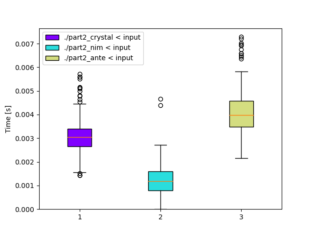

# Day 6: [Tuning Trouble](https://adventofcode.com/2022/day/6)
*Nim: [Part 1](https://github.com/DestyNova/advent_of_code_2022/blob/main/6/part1.nim) (00:06:22, rank 3222), [Part 2](https://github.com/DestyNova/advent_of_code_2022/blob/main/6/part2.nim) (00:07:24, 2801)*

Walk a single string until a unique chunk of length N is found, then return the index after the end of the chunk. A much, much easier problem than yesterday.

## Part 1

I decided to start with Nim, expecting to use the `std/strscans` module this time in case there was difficult parsing. However it turned out to be the simplest format you could expect to get: a single line with one string of alphabetic characters.

## Part 2

This was an incredibly small tweak to the first program. In fact if I'd written it a bit smarter (using a constant for the chunk length), I could just have changed the constant. Oh well. I updated the program after the fact to specify `chunkSize` at the top rather than having magic numbers everywhere.

## Alternate implementations

### Crystal

The problem was simple enough that I decided to implement the Crystal version without referring to my Nim code. However, for one reason or another it still took me a few minutes.

### Ante

With some changes to the Ante standard library prelude, I was able to write an Ante program to solve today's puzzle. It took quite a while, since I ran into some issues, probably the most confusing being that without specifying the value type of the hashmap for each chunk (there's no sets in the stdlib yet), the `get_entry` (and thus `get`) functions returned `None` when they shouldn't. I don't really understand why, but there's probably some bugs in the `HashMap` module -- when printing the map you can see the same key twice in many cases. But anyway, it was nice to get it working at the end.

## Thoughts

This is the kind of problem that probably has a 4 or 5 character solution in APL or J. Anyway, I still took a few minutes to get it done, getting some of the ranges wrong (tip: `0..4` is an inclusive range). Otherwise I'm pretty happy with it despite the unimpressive ranking.

It seems obvious to say this now, but... it actually helps a lot to be very familiar and comfortable with the important stdlib modules in whatever languages you're using when speedcoding. I got stuck for 30 seconds when writing the Crystal implementation, trying to convert the string chunks to a set. I expected something like this would work:

```crystal
uniq = Set(chunk).size
# or...
uniq = Set(chunk.chars).size
```

But I needed to do this:

```crystal
uniq = chunk.chars.to_set.size
```

In Haskell this kind of thing might be done with `length $ nub chunk`, importing `Data.List (nub)`. It'll probably take quite a few more days of puzzling before I start to learn some of the more common things in Nim and Crystal.

But by then, we'll probably be onto much more difficult problems where the small overhead of not knowing the stdlib -- and the time it takes to just read the problem text -- becomes a very small proportion of the total solving time. A couple of the puzzles last year took me over 10 hours in Haskell, so... yeah.

## Benchmarks

Another very computationally cheap puzzle from which there are no interesting conclusions to be drawn about the various language implementations.

### Time

```
Benchmark 1: ./part2_crystal < input
  Time (mean ± σ):       3.0 ms ±   0.7 ms    [User: 2.0 ms, System: 1.3 ms]
  Range (min … max):     1.4 ms …   5.7 ms    531 runs

  Warning: Command took less than 5 ms to complete. Note that the results might be inaccurate because hyperfine can not calibrate the shell startup time much more precise than this limit. You can try to use the `-N`/`--shell=none` option to disable the shell completely.

Benchmark 2: ./part2_nim < input
  Time (mean ± σ):       1.2 ms ±   0.6 ms    [User: 0.9 ms, System: 0.7 ms]
  Range (min … max):     0.0 ms …   4.7 ms    966 runs

  Warning: Command took less than 5 ms to complete. Note that the results might be inaccurate because hyperfine can not calibrate the shell startup time much more precise than this limit. You can try to use the `-N`/`--shell=none` option to disable the shell completely.

Benchmark 3: ./part2_ante < input
  Time (mean ± σ):       4.0 ms ±   0.8 ms    [User: 2.8 ms, System: 1.6 ms]
  Range (min … max):     2.2 ms …   7.3 ms    689 runs

  Warning: Command took less than 5 ms to complete. Note that the results might be inaccurate because hyperfine can not calibrate the shell startup time much more precise than this limit. You can try to use the `-N`/`--shell=none` option to disable the shell completely.

Summary
  './part2_nim < input' ran
    2.60 ± 1.40 times faster than './part2_crystal < input'
    3.45 ± 1.85 times faster than './part2_ante < input'
```



### Summary

Program       | Compile time (s) | Mean runtime (ms) | Max RSS (kb) | Source bytes | Source gzipped
---           | ---              | ---               | ---          | ---          | ---
part2_crystal | 17.131           | 3.1               | 4012         | 197          | 146
part2_nim     | 1.068            | 1.1               | 1640         | 218          | 157
part2_ante    | 0.174            | 4.1               | 3680         | 683          | 337
