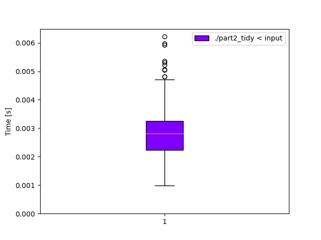

# Day 9: [Rope Bridge](https://adventofcode.com/2022/day/9)
*Nim: [Part 1](https://github.com/DestyNova/advent_of_code_2022/blob/main/9/part1.nim) (00:33:10, rank 4628), [Part 2](https://github.com/DestyNova/advent_of_code_2022/blob/main/9/part2.nim) (01:04:50, rank 4698)*

Another grid game: Snake? SNAAAAAAAKE!!!

## Part 1

I made a big overthink move at the beginning that came back to bite me later. This was another simple puzzle that just needed good reading comprehension. Unfortunately it just took me too long to grok the problem description and example, when it came to the diagonal movement and sort of springiness of the tail.

## Part 2

This is where my optimisation from the beginning hurt: I decided to move the front knot by all its steps in one go, then slide the tail one step at a time. Since I was moving by one step at a time anyway, there was no value in processing the head's movement in one go. While it worked in part 1, it caused an incorrect (too low) result in part 2.

Annoyingly, the sample inputs both produced correct results, although I wasn't checking the intervening grid states. So at this point I spent some time to write a `renderGrid` function to display the head and tail knots. This still didn't give me anything other than that the first sample input was behaving ok.

Eventually, I didn't know what else to do, and processing the head knot's movement one step at a time seemed worth trying. This turned out to be the key. Pity I hadn't just done that in part 1, but... hey.

## Alternate implementations

(none yet)

## Thoughts

Afterwards, I was chatting with some fellow hackmeisters and saw someone's Rust code, where they were doing signums in the knot update step. This seemed much nicer than the big block of if conditions I ended up with, so I applied the same change in `part2_tidy.nim`.

Additionally, I figured out how to make sets work properly in Nim: when I first tried to use them in part 1, I got an error that it can only store ordinal types. Turns out there are a couple of different set implementations in Nim, and the default one (`set[T]`) is a bitset implementation which can only store items with a known bit representation in a fixed range. Instead, in `std/sets` we can find the `HashSet[T]` type, which uses hashing to store any type you like. At first I was really confused by [the docs](https://nim-lang.org/docs/sets.html) which don't make it obvious up front how to add a new element to an existing mutable set. Turns out you call the `incl` (or `containsOrIncl`) procs on the set. I found this very unintuitive because "incl" sounds like a predicate (i.e. "does the set include this value?") rather than a mutator, and I'd been expecting something like `add`, `insert` or `+=`. I had to search the doc for `var HashSet` to find the procs that mutate the set.

Overall, I didn't score well but I'm pretty happy with this one anyway. It was a nice problem, although I was starting to get worried when my program worked on the sample inputs but not on the full input. That's a bad situation to be in because it's so hard to get clues about why it's not working.

## Benchmarks

(none yet)

### Time

```
(no)
```



### Summary

Program       | Compile time (s) | Mean runtime (ms) | Max RSS (kb) | Source bytes | Source gzipped
---           | ---              | ---               | ---          | ---          | ---
part2_crystal |                  |                   |              |              |    
part2_nim     |                  |                   |              |              |    
